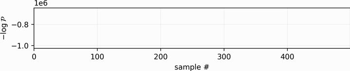
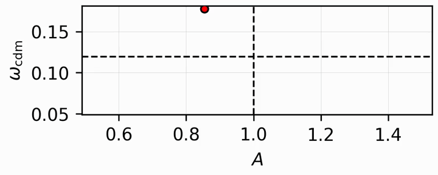
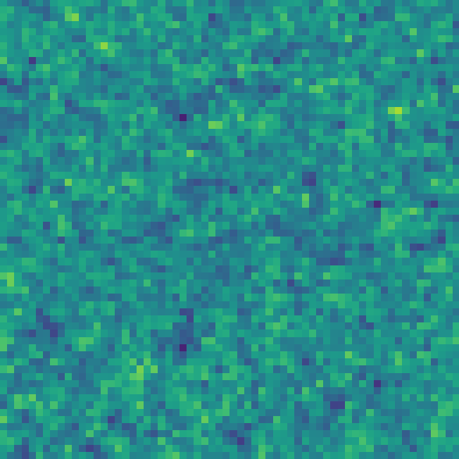
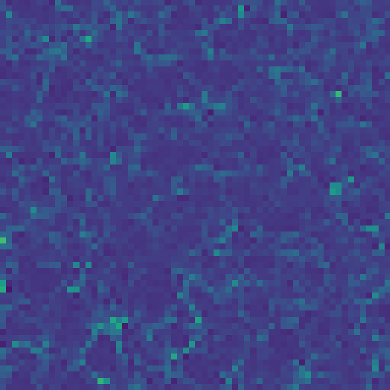

# Cosmology inference at the field level with perturbative forward modeling

A pipeline for field-level Bayesian inference of large scale structure with JAX and NumPyro.  
This repository connects a perturbative forward model to a field level likelihood and runs NUTS with a restartable state.

*Based on Akitsu, Simonović, Chen, Cabass, and Zaldarriaga ([arXiv:2509.09673](https://arxiv.org/abs/2509.09673)).*

---

## Features

- Gaussian field-level likelihood in Fourier space or position space  
  - For the position-space likelihood, a density-dependent variance is available.
- Forward models: Gaussian linear field, Eulerian PT up to second order, and Lagrangian PT with first or second order displacement (shifted operators), with up to quadratic galaxy bias and counterterm coefficients.
- Sampling: initial conditions (sampled or fixed), cosmology ($A$, $\omega_{\rm cdm}$, $H_0$, etc.), and bias parameters.

---

## Prerequisites

- Python >= 3.10
- NumPy >= 2.1
- JAX >= 0.4.3
- NumPyro
- CosmoPower-JAX (for a differentiable linear power spectrum)
- [`lss_utils`](https://github.com/kazakitsu/lss_utils)
- [`PT_field`](https://github.com/kazakitsu/PT-field-modeling)

---

## Demo

  
Click to expand

  <table>
    <tr>
      <td colspan="2" align="center">
        
− log P

        
      </td>
    </tr>
    <tr>
      <td colspan="2" align="center">
        
posterior of cosmology

        
      </td>
    </tr>
    <tr>
      <td align="center">
        
sampled initial conditions

        
      </td>
      <td align="center">
        
sampled final field

        
      </td>
    </tr>
    <tr>
      <td align="center">
        
true initial conditions

        
      </td>
      <td align="center">
        
true final field

        
      </td>
    </tr>
  </table>

